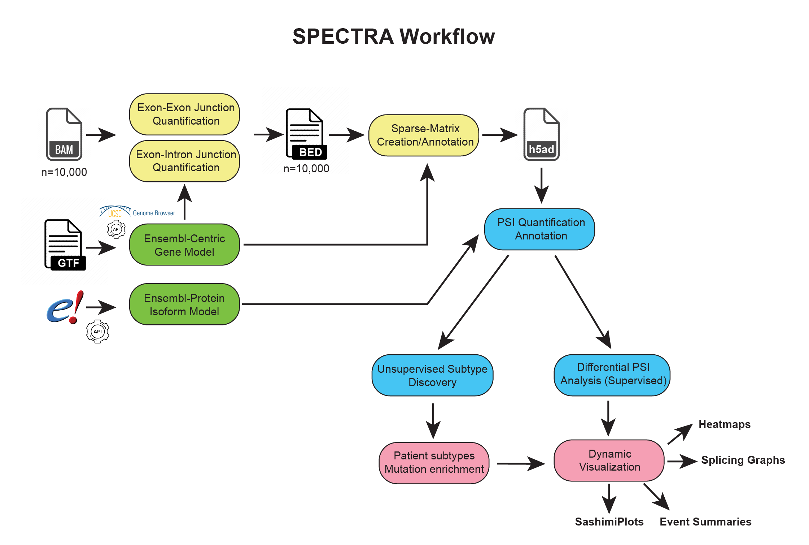

# SPECTRA

## ✂️ About

**SPECTRA** (Splicing-based Pattern Extraction and Clustering using TRAnscriptomics) is an end-to-end pipeline for discovering patient subtypes based on alternative splicing. It is a modernized and optimized version of the original OncoSplice algorithm.

SPECTRA leverages an **iterative clustering strategy** to identify stable and dominant splicing patterns across patient samples. The new implementation enhances the **speed**, **accuracy**, and **modularity**, allowing seamless integration into both command-line workflows and interactive Python environments.

## 📌 Installation

Coming soon — instructions for installing SPECTRA as a Python package via `pip`.

## 📚 Documentation

Detailed documentation, including parameter descriptions, expected input/output formats, and customization options, will be available shortly.

## 👩‍🏫 Tutorial

SPECTRA can be used in two ways:
- As a **command-line tool** for end-to-end execution
- As a **modular workflow**, where individual functions are called step-by-step

See the tutorials and example scripts for each approach:

### Command-Line Interface (CLI)

Run the entire pipeline with a single command using `main.py`. This is ideal for multiple dataset processing and automated workflows.

### Modular Usage

Import and run individual components such as preprocessing, clustering, or visualization in a custom step-by-step analysis.

## 📝 Overview of Modules

| Module | Description |
|--------|-------------|
| `main.py` | Entry point for running the complete SPECTRA pipeline. Handles argument parsing and execution flow. |
| `RoundWrapper.py` | Wraps a single iteration of clustering (SPECTRA performs 3 iterations by default). |
| `preprocess.py` | Performs variance-based and intercorrelation-based filtering of splicing events prior to clustering. |
| `removeRedundantSplicingEvents.py` | Removes redundant splicing events based on intra-gene correlation. |
| `PCAbasedFeatureSelection.py` | Implements PCA-based feature selection, similar to the splice-ICGS method in the original OncoSplice. |
| `medianImpute.py` | Imputes missing values in the splicing matrix using the median for each event. |
| `visualizations.py` | Generates visual summaries, including splicing event annotation bar plots and cluster heatmaps. |
| `determineNMFRank.py` | Automatically determines the optimal NMF rank (if not user-specified). |
| `runNMF.py` | Performs NMF clustering and assigns multi-label cluster memberships. |
| `metadataAnalysis.py` | Analyzes and annotates differential splicing events across clusters. |
| `linearSVM.py` | Applies linear SVM for final cluster assignment. |
| `correlationDepletion.py` | Identifies and depletes splicing events associated with a clustering round. |
| `correlationDepletion_vectorized.py` | A faster version of `correlationDepletion.py` using imputed values and optimized calculations. |

## 📖 Citation

Coming soon — citation information for referencing SPECTRA in publications.
